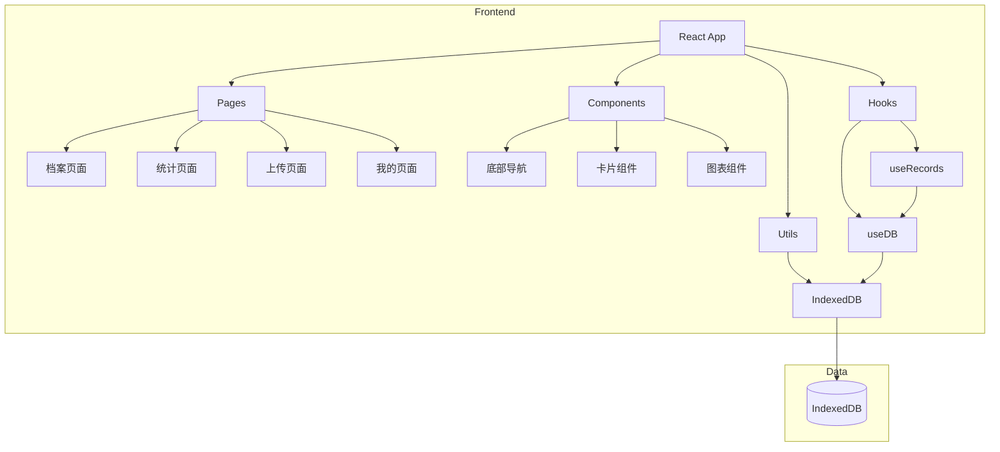
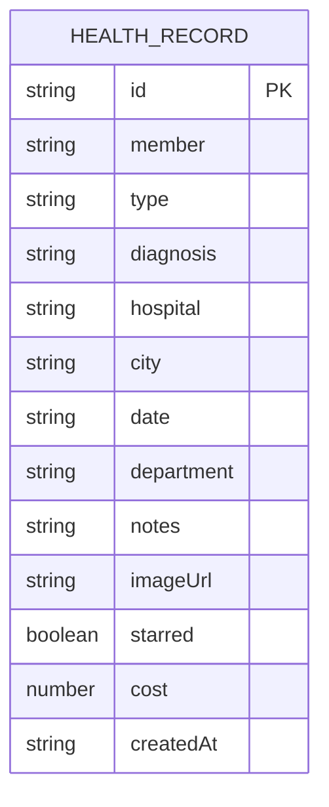

## 1. Architecture Design



## 2. Technology Description

- **Frontend**: React 18 + TypeScript + Vite
- **Styling**: Tailwind CSS v3 + clsx + tailwind-merge
- **Icons**: Lucide React
- **Charts**: Recharts
- **Routing**: React Router v6
- **Storage**: IndexedDB (localForage or native)
- **State Management**: React Context API + useState
- **Initialization Tool**: vite-init

## 3. Route Definitions

| Route | Purpose |
|-------|---------|
| / | 档案页面 - 健康记录时间线 |
| /statistics | 统计页面 - 数据可视化分析 |
| /upload | 上传页面 - 添加新健康记录 |
| /profile | 我的页面 - 个人信息和设置 |
| /record/:id | 记录详情页 |

## 4. Data Model

### 4.1 Data Model Definition



### 4.2 TypeScript Types

```typescript
type RecordType = '病历' | '检查报告' | '检验结果' | '其他';

interface HealthRecord {
  id: string;
  member: string;
  type: RecordType;
  diagnosis: string;
  hospital: string;
  city: string;
  date: string;
  department: string;
  notes: string;
  imageUrl: string;
  starred: boolean;
  cost: number;
  createdAt: string;
}

interface FilterState {
  member: string;
  type: string;
  timeRange: string;
  searchQuery: string;
}
```

### 4.3 Initial Data

内置10条完整模拟数据，覆盖2010-2026年。

## 5. Project Structure

```
/workspace
├── src/
│   ├── components/
│   │   ├── BottomNav.tsx
│   │   ├── RecordCard.tsx
│   │   ├── TimelineGroup.tsx
│   │   └── ...
│   ├── pages/
│   │   ├── ArchivePage.tsx
│   │   ├── StatisticsPage.tsx
│   │   ├── UploadPage.tsx
│   │   └── ProfilePage.tsx
│   ├── hooks/
│   │   ├── useDB.ts
│   │   └── useRecords.ts
│   ├── utils/
│   │   ├── db.ts
│   │   ├── constants.ts
│   │   └── types.ts
│   ├── App.tsx
│   └── main.tsx
├── public/
├── package.json
├── vite.config.ts
├── tailwind.config.js
├── tsconfig.json
└── README.md
```

## 6. Key Implementation Details

### 6.1 IndexedDB Wrapper

使用IndexedDB进行本地数据存储，支持：
- 初始化和数据库版本管理
- 增删改查操作
- 数据持久化
- 重置功能

### 6.2 State Management

使用React Context API管理应用状态：
- 健康记录列表
- 筛选条件
- 导航状态
- 主题设置

### 6.3 Responsive Design

使用Tailwind CSS响应式断点：
- sm: 640px (手机)
- md: 768px (平板)
- lg: 1024px (小屏电脑)
- xl: 1280px (大屏电脑)

### 6.4 Performance Optimization

- 图片懒加载
- 虚拟滚动（长列表）
- 组件懒加载
- 防抖搜索
