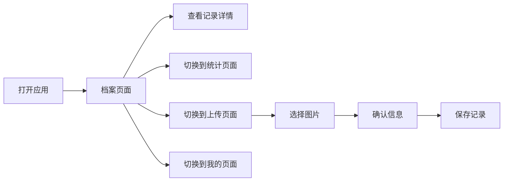

## 1. Product Overview

健康管家是一款纯前端单页应用，专注于本地加密存储用户的健康档案数据。产品主打100%本地存储，所有健康数据只保存在用户设备上，绝对不上传任何服务器，为用户提供极致的隐私安全保障。

- 解决用户健康数据隐私担忧问题，提供本地安全的健康档案管理解决方案
- 目标用户为注重个人隐私、需要长期管理健康记录的人群

## 2. Core Features

### 2.1 User Roles

| Role | Registration Method | Core Permissions |
|------|---------------------|------------------|
| Normal User | 无需注册 | 管理和查看个人健康档案、数据统计、上传记录、系统设置 |

### 2.2 Feature Module

1. **档案页面**：时间线展示、多维度筛选、搜索、导出
2. **统计页面**：数据可视化、趋势分析、健康报告
3. **上传页面**：图片上传、OCR模拟、快捷添加
4. **我的页面**：个人信息、家庭管理、数据安全、系统设置

### 2.3 Page Details

| Page Name | Module Name | Feature description |
|-----------|-------------|---------------------|
| 档案页面 | 时间线展示 | 按年月分组展示健康记录，支持折叠展开 |
| 档案页面 | 筛选搜索 | 成员、类型、时间筛选，关键词搜索 |
| 统计页面 | 数据概览 | 6个关键数据卡片展示 |
| 统计页面 | 可视化图表 | 折线图、饼图、柱状图展示健康趋势 |
| 上传页面 | 图片上传 | 拍照/相册选择，支持批量 |
| 上传页面 | OCR模拟 | 自动填充识别信息 |
| 我的页面 | 数据安全 | 本地备份、恢复、应用锁 |

## 3. Core Process

### 主要用户流程
用户打开应用后，默认展示健康档案时间线。可以通过底部导航切换到统计、上传或个人中心。在档案页面，用户可以查看、筛选、搜索健康记录，点击进入详情。在统计页面查看健康数据分析。在上传页面添加新记录。在个人中心管理设置和数据。

## 4. User Interface Design

### 4.1 Design Style
- **主色调**：#22C55E（健康绿）
- **辅助色**：病历#3B82F6（蓝）、检查报告#22C55E（绿）、检验结果#F97316（橙）、警告#EF4444（红）
- **中性色**：背景#F9FAFB、卡片#FFFFFF、边框#D1D5DB、次要文字#6B7280、主要文字#111827
- **按钮风格**：圆角8px，高度44px，font-medium，16px字体
- **卡片风格**：圆角12px，shadow-sm，内边距16px
- **布局风格**：底部导航固定，顶部栏展示，内容区滚动
- **图标风格**：使用Lucide React图标库
- **响应式**：完美适配375px-1440px宽度

### 4.2 Page Design Overview

| Page Name | Module Name | UI Elements |
|-----------|-------------|-------------|
| 档案页面 | 顶部导航 | 标题、搜索、导出、更多按钮 |
| 档案页面 | 筛选栏 | 成员、类型、时间筛选标签 |
| 档案页面 | 时间线 | 年月分组、记录卡片 |
| 统计页面 | 数据概览 | 2×3网格卡片 |
| 统计页面 | 图表区 | 折线图、饼图、柱状图 |
| 上传页面 | 上传流程 | 分步引导、图片预览、表单填写 |
| 我的页面 | 个人信息 | 渐变背景、头像、昵称 |
| 我的页面 | 功能列表 | 分组展示设置项 |

### 4.3 Responsiveness

采用移动优先设计，完美适配375px-1440px宽度范围。在手机端保持简洁易用的交互，在电脑端提供更宽敞的布局体验。所有组件支持触摸操作和鼠标操作。

### 4.4 交互效果
- 页面切换平滑过渡动画
- 按钮点击反馈效果
- 卡片悬停效果
- 图表加载动画
- 列表流畅滚动
