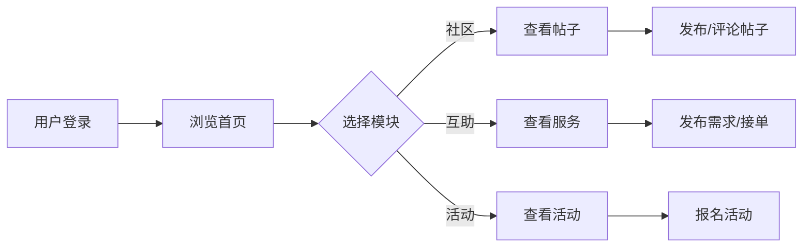

## 1. Product Overview
宠物互助社区是一个专为宠物主人打造的在线交流与互助平台，旨在连接宠物爱好者，促进宠物相关的互助服务和社区活动。
- 核心功能：宠物社区交流、互助服务（遛狗、喂养等）、活动参与
- 目标用户：宠物主人、宠物爱好者、宠物服务提供者

## 2. Core Features

### 2.1 User Roles
| Role | Registration Method | Core Permissions |
|------|---------------------|------------------|
| 用户 | 手机号/邮箱注册 | 浏览帖子、发布互助需求、参与活动 |
| 服务提供者 | 实名认证 | 发布服务、接单服务、评价管理 |

### 2.2 Feature Module
1. **首页**: 社区动态、热门帖子、活动推荐、互助服务入口
2. **社区**: 帖子列表、帖子详情、评论互动
3. **互助**: 服务列表、发布需求、接单管理
4. **活动**: 活动列表、报名参与、活动详情
5. **个人中心**: 用户信息、我的帖子、我的服务、我的活动

### 2.3 Page Details
| Page Name | Module Name | Feature description |
|-----------|-------------|---------------------|
| 首页 | Hero区域 | 轮播图展示社区亮点 |
| 首页 | 动态流 | 展示最新社区帖子 |
| 首页 | 互助卡片 | 热门互助服务推荐 |
| 首页 | 活动推荐 | 近期活动展示 |
| 社区 | 帖子列表 | 分类筛选、搜索功能 |
| 社区 | 帖子详情 | 图文展示、评论互动 |
| 互助 | 服务列表 | 按服务类型筛选 |
| 互助 | 发布需求 | 填写服务详情、价格范围 |
| 活动 | 活动列表 | 时间、地点筛选 |
| 活动 | 活动详情 | 报名表单、活动介绍 |
| 个人中心 | 我的信息 | 头像、昵称、宠物资料 |

## 3. Core Process
用户注册登录 → 浏览社区/互助/活动 → 发布帖子/需求/报名 → 互动交流 → 完成服务/活动

## 4. User Interface Design

### 4.1 Design Style
- **主色调**: 温暖橙色 (#FF8C42) 搭配清新绿色 (#4ECDC4)
- **辅助色**: 柔和灰色 (#F5F5F5)、深灰色文字 (#333333)
- **按钮风格**: 圆角矩形，渐变色填充
- **字体**: 思源黑体，标题加粗，正文清晰可读
- **布局**: 卡片式设计，响应式网格布局
- **图标**: 使用 Lucide 图标库，圆润可爱风格

### 4.2 Page Design Overview
| Page Name | Module Name | UI Elements |
|-----------|-------------|-------------|
| 首页 | Hero区域 | 全屏轮播、渐变背景、号召性按钮 |
| 首页 | 动态流 | 卡片列表、头像、标题、摘要、互动按钮 |
| 互助 | 服务卡片 | 服务图标、价格、距离、评分、标签 |
| 活动 | 活动卡片 | 活动图片、时间、地点、报名人数 |
| 个人中心 | 用户卡片 | 圆形头像、昵称、宠物数量、粉丝数 |

### 4.3 Responsiveness
- 桌面优先设计
- 移动端自适应布局
- 触控友好的按钮尺寸（最小44px）