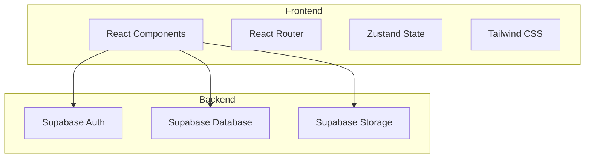
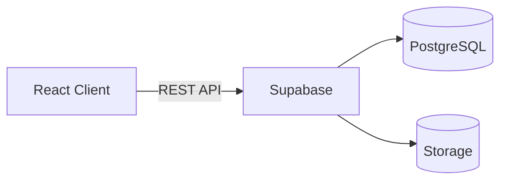
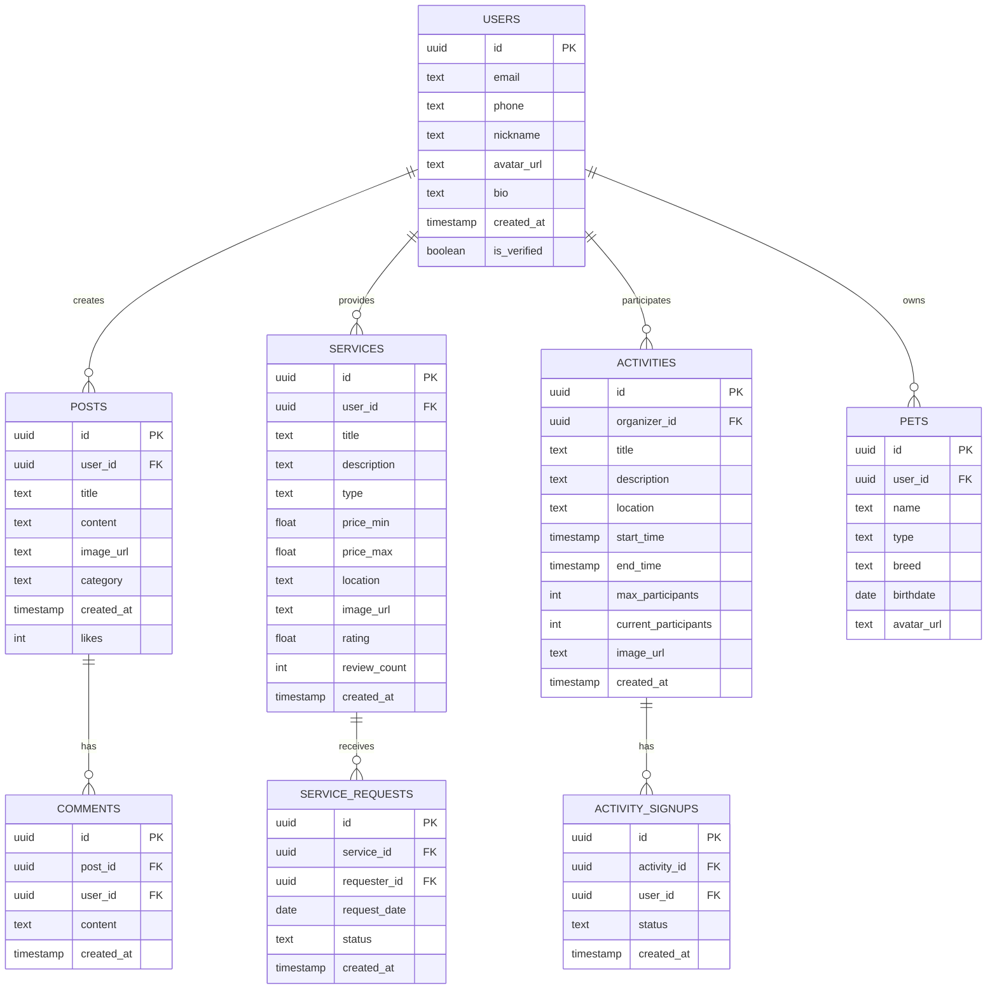

## 1. Architecture Design

## 2. Technology Description
- Frontend: React@18 + TypeScript + TailwindCSS@3 + Vite
- Initialization Tool: vite-init
- Backend: Supabase (Authentication, Database, Storage)
- State Management: Zustand
- Icons: Lucide React

## 3. Route Definitions
| Route | Purpose | Component |
|-------|---------|-----------|
| / | 首页 | HomePage |
| /community | 社区列表 | CommunityPage |
| /community/:id | 帖子详情 | PostDetailPage |
| /help | 互助服务 | HelpPage |
| /help/:id | 服务详情 | HelpDetailPage |
| /activities | 活动列表 | ActivitiesPage |
| /activities/:id | 活动详情 | ActivityDetailPage |
| /profile | 个人中心 | ProfilePage |
| /login | 登录页 | LoginPage |
| /register | 注册页 | RegisterPage |

## 4. API Definitions
通过 Supabase Client SDK 直接访问数据库，无需额外后端API。

## 5. Server Architecture Diagram

## 6. Data Model

### 6.1 Data Model Definition
